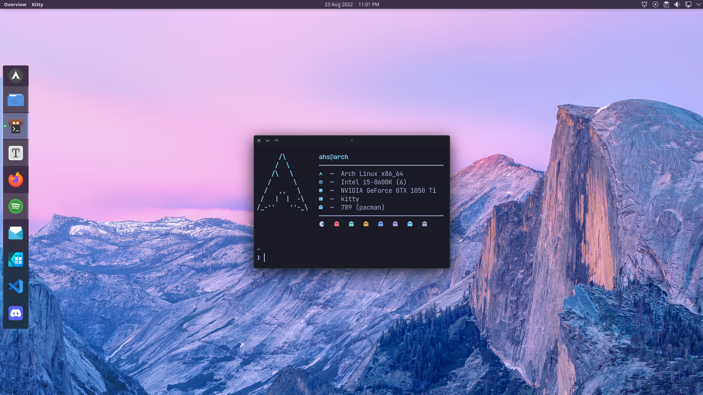
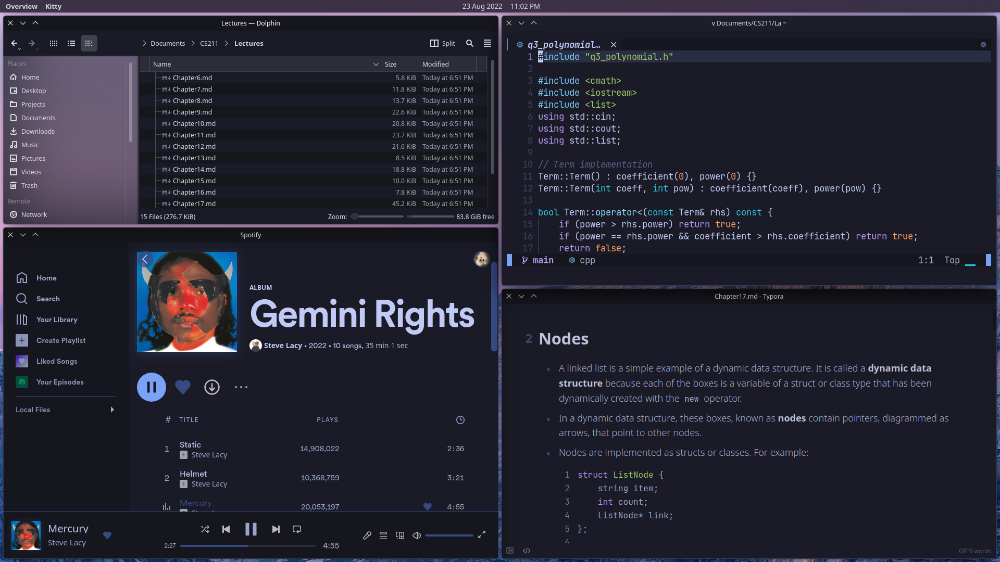

# KDE Tokyo Night Theme





-   WM: KWin (with tiling using [Bismuth](https://github.com/Bismuth-Forge/bismuth))
-   Global theme: [Breeze Dark](https://store.kde.org/p/1168533)
-   Application Style: [Lightly](https://github.com/Luwx/Lightly)
-   Colors: [Tokyo Night](https://github.com/nonetrix/tokyonight-kde)
-   Plasma Style: Breeze Dark
-   Window Decorations: Breeze Dark
-   Icons: [Tela](https://github.com/vinceliuice/Tela-icon-theme)
-   Neofetch theme: [Custom](https://github.com/ahs718/dotfiles/blob/main/neofetch/config.conf) (based on Chick2D's [neofetch themes](https://github.com/chick2d/neofetch-themes) repository)
-   Tokyo Night theme for Spotify (and other programs): [Tokyo-Night-Linux](https://github.com/stronk-dev/Tokyo-Night-Linux)
-   Neovim config: [AstroNvim](https://github.com/AstroNvim/AstroNvim) with [tokyonight](https://github.com/folke/tokyonight.nvim) theme plugin
-   Left panel and top menu bar are both default plasma panels
    -   Top menu bar widgets: [Text command](https://store.kde.org/p/1704465/), [Window Title Applet](https://store.kde.org/p/1274218/), [Better Inline Clock](https://store.kde.org/p/1245902)

## Additional Programs

### (Arch Linux) AUR Helper

```bash
sudo pacman -S --needed base-devel
git clone https://aur.archlinux.org/paru.git
cd paru
makepkg -si
```

### Firefox Extensions And Themes

- [uBlock Origin](https://addons.mozilla.org/en-US/firefox/addon/ublock-origin/?utm_source=addons.mozilla.org&utm_medium=referral&utm_content=search)
  - [uBlock settings file](firefox/ublock-settings.txt)
  - [SponsorBlock settings file](firefox/sponsorblock-settings.json)
- [Multi-Account Containers](https://addons.mozilla.org/en-US/firefox/addon/multi-account-containers/)
- [LocalCDN](https://addons.mozilla.org/en-US/firefox/addon/localcdn-fork-of-decentraleyes/?utm_source=addons.mozilla.org&utm_medium=referral&utm_content=search)
- [Bitwarden](https://addons.mozilla.org/en-US/firefox/addon/bitwarden-password-manager/)
- [Cookie Auto Delete](https://addons.mozilla.org/en-US/firefox/addon/cookie-autodelete/?utm_source=addons.mozilla.org&utm_medium=referral&utm_content=search)
- [SponsorBlock](https://addons.mozilla.org/en-US/firefox/addon/sponsorblock/)
- [Return YouTube Dislike](https://addons.mozilla.org/en-US/firefox/addon/return-youtube-dislikes/)
- [Reddit Enhancement Suite](https://addons.mozilla.org/en-US/firefox/addon/reddit-enhancement-suite/)
- [Tokyo Night](https://addons.mozilla.org/en-US/firefox/addon/tokyonight_vim/?utm_source=addons.mozilla.org&utm_medium=referral&utm_content=search)
